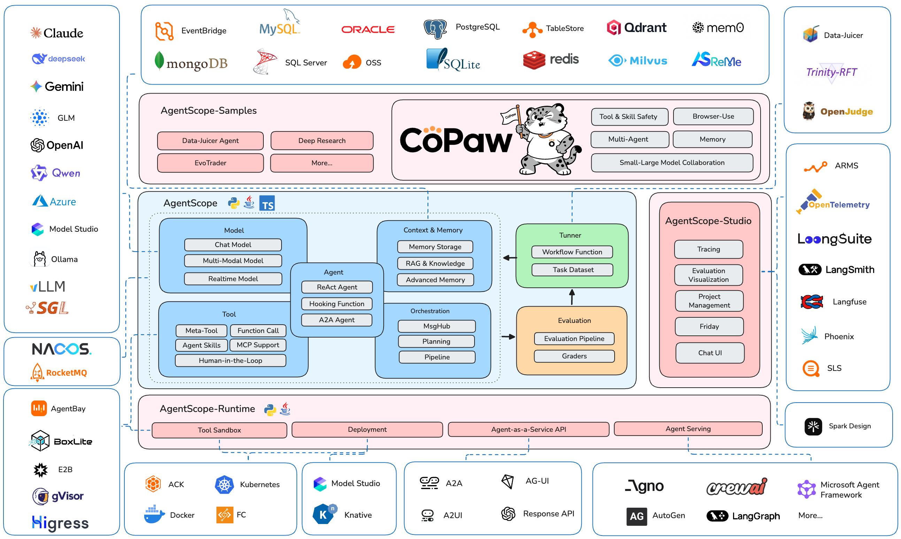

<p align="center">
  
</p>

<span align="center">

[**English Homepage**](https://github.com/agentscope-ai/agentscope/blob/main/README.md) | [**Tutorial**](https://doc.agentscope.io/zh_CN/) | [**Roadmap (Jan 2026 -)**](https://github.com/agentscope-ai/agentscope/blob/main/docs/roadmap.md) | [**FAQ**](https://doc.agentscope.io/zh_CN/tutorial/faq.html)

</span>

<p align="center">
    <a href="https://arxiv.org/abs/2402.14034">
        
    </a>
    <a href="https://pypi.org/project/agentscope/">
        
    </a>
    <a href="https://pypi.org/project/agentscope/">
        
    </a>
    <a href="https://discord.gg/eYMpfnkG8h">
        
    </a>
    <a href="https://doc.agentscope.io/">
        
    </a>
    <a href="./LICENSE">
        
    </a>
</p>

<p align="center">

</p>

## What is AgentScope？

AgentScope 是一款企业级开箱即用的智能体框架，提供灵活的核心抽象以适配不断进化的模型能力，并原生支持模型微调。

我们为新一代自主智能的大语言模型而生。 我们的理念是释放模型的推理与工具调用潜能，而不是用僵化的提示工程和预设流程束缚它们的手脚。

## Why use AgentScope？

- **简单**: 使用内置的 ReAct 智能体、工具、技能、人机协作、记忆、计划、实时语音、评估和模型微调轻松构建智能体应用
- **可扩展**: 大量生态系统集成，包括工具、记忆和可观察性；内置 MCP 和 A2A 支持；消息中心（MsgHub）提供灵活的多智能体编排能力
- **生产就绪**: 在本地、云端 Serverless 或 K8s 集群上轻松部署智能体应用，并内置 OTel 可观察性支持


<p align="center">

<br/>
AgentScope 生态
</p>


## 📢 新闻
<!-- BEGIN NEWS -->
- **[2026-02] `功能`:** 支持实时语音交互。[样例](https://github.com/agentscope-ai/agentscope/tree/main/examples/agent/realtime_voice_agent) | [多智能体实时交互](https://github.com/agentscope-ai/agentscope/tree/main/examples/workflows/multiagent_realtime) | [文档](https://doc.agentscope.io/tutorial/task_realtime.html)
- **[2026-01] `社区`:** AgentScope 双周会议启动，分享生态更新和开发计划 - 欢迎加入！[详情与安排](https://github.com/agentscope-ai/agentscope/discussions/1126)
- **[2026-01] `功能`:** 记忆模块新增数据库支持和记忆压缩。[样例](https://github.com/agentscope-ai/agentscope/tree/main/examples/functionality/short_term_memory/memory_compression) | [教程](https://doc.agentscope.io/tutorial/task_memory.html)
- **[2025-12] `集成`:** A2A（智能体间通信）协议支持。[样例](https://github.com/agentscope-ai/agentscope/tree/main/examples/agent/a2a_agent) | [教程](https://doc.agentscope.io/zh_CN/tutorial/task_a2a.html)
- **[2025-12] `功能`:** TTS（文本转语音）支持。[样例](https://github.com/agentscope-ai/agentscope/tree/main/examples/functionality/tts) | [教程](https://doc.agentscope.io/zh_CN/tutorial/task_tts.html)
- **[2025-11] `集成`:** Anthropic Agent Skill 支持。[样例](https://github.com/agentscope-ai/agentscope/tree/main/examples/functionality/agent_skill) | [教程](https://doc.agentscope.io/zh_CN/tutorial/task_agent_skill.html)
- **[2025-11] `发布`:** 面向多样化真实任务的 Alias-Agent 和数据处理的 Data-Juicer Agent 开源。[Alias-Agent](https://github.com/agentscope-ai/agentscope-samples/tree/main/alias) | [Data-Juicer Agent](https://github.com/agentscope-ai/agentscope-samples/tree/main/data_juicer_agent)
- **[2025-11] `集成`:** 通过 Trinity-RFT 库实现智能体强化学习。[样例](https://github.com/agentscope-ai/agentscope/tree/main/examples/tuner/react_agent) | [Trinity-RFT](https://github.com/agentscope-ai/Trinity-RFT)
- **[2025-11] `集成`:** ReMe 增强长期记忆。[样例](https://github.com/agentscope-ai/agentscope/tree/main/examples/functionality/long_term_memory/reme)
- **[2025-11] `发布`:** agentscope-samples 样例库上线，agentscope-runtime 升级支持 Docker/K8s 部署和 VNC 图形沙盒。[样例库](https://github.com/agentscope-ai/agentscope-samples) | [Runtime](https://github.com/agentscope-ai/agentscope-runtime)
<!-- END NEWS -->

[更多新闻 →](./docs/NEWS_zh.md)

## 联系我们

欢迎加入我们的社区！

| [Discord](https://discord.gg/eYMpfnkG8h)                                                                                         | 钉钉                                                                        |
|----------------------------------------------------------------------------------------------------------------------------------|---------------------------------------------------------------------------|
|  |  |

<!-- START doctoc generated TOC please keep comment here to allow auto update -->
<!-- DON'T EDIT THIS SECTION, INSTEAD RE-RUN doctoc TO UPDATE -->
## 📑 Table of Contents

- [快速开始](#%E5%BF%AB%E9%80%9F%E5%BC%80%E5%A7%8B)
  - [安装](#%E5%AE%89%E8%A3%85)
    - [从 PyPI 安装](#%E4%BB%8E-pypi-%E5%AE%89%E8%A3%85)
    - [从源码安装](#%E4%BB%8E%E6%BA%90%E7%A0%81%E5%AE%89%E8%A3%85)
- [样例](#%E6%A0%B7%E4%BE%8B)
  - [Hello AgentScope！](#hello-agentscope)
  - [语音智能体](#%E8%AF%AD%E9%9F%B3%E6%99%BA%E8%83%BD%E4%BD%93)
  - [实时语音智能体](#%E5%AE%9E%E6%97%B6%E8%AF%AD%E9%9F%B3%E6%99%BA%E8%83%BD%E4%BD%93)
  - [人机协作](#%E4%BA%BA%E6%9C%BA%E5%8D%8F%E4%BD%9C)
  - [灵活的 MCP 控制](#%E7%81%B5%E6%B4%BB%E7%9A%84-mcp-%E6%8E%A7%E5%88%B6)
  - [智能体强化学习](#%E6%99%BA%E8%83%BD%E4%BD%93%E5%BC%BA%E5%8C%96%E5%AD%A6%E4%B9%A0)
  - [多智能体工作流](#%E5%A4%9A%E6%99%BA%E8%83%BD%E4%BD%93%E5%B7%A5%E4%BD%9C%E6%B5%81)
- [文档](#%E6%96%87%E6%A1%A3)
- [更多样例](#%E6%9B%B4%E5%A4%9A%E6%A0%B7%E4%BE%8B)
  - [功能](#%E5%8A%9F%E8%83%BD)
  - [智能体](#%E6%99%BA%E8%83%BD%E4%BD%93)
  - [游戏](#%E6%B8%B8%E6%88%8F)
  - [工作流](#%E5%B7%A5%E4%BD%9C%E6%B5%81)
  - [评估](#%E8%AF%84%E4%BC%B0)
  - [微调](#%E5%BE%AE%E8%B0%83)
- [贡献](#%E8%B4%A1%E7%8C%AE)
- [许可](#%E8%AE%B8%E5%8F%AF)
- [论文](#%E8%AE%BA%E6%96%87)
- [贡献者](#%E8%B4%A1%E7%8C%AE%E8%80%85)

<!-- END doctoc generated TOC please keep comment here to allow auto update -->

## 快速开始

### 安装

> AgentScope 需要 **Python 3.10** 或更高版本。

#### 从 PyPI 安装

```bash
pip install agentscope
```

或使用 uv：

```bash
uv pip install agentscope
```

#### 从源码安装

```bash
# 从 GitHub 拉取源码
git clone -b main https://github.com/agentscope-ai/agentscope.git

# 以可编辑模式安装包
cd agentscope

pip install -e .
# 或使用 uv：
# uv pip install -e .
```

## 样例

### Hello AgentScope！

开始与名为"Friday"的 ReAct 智能体 🤖 进行对话！

```python
from agentscope.agent import ReActAgent, UserAgent
from agentscope.model import DashScopeChatModel
from agentscope.formatter import DashScopeChatFormatter
from agentscope.memory import InMemoryMemory
from agentscope.tool import Toolkit, execute_python_code, execute_shell_command
import os, asyncio


async def main():
    toolkit = Toolkit()
    toolkit.register_tool_function(execute_python_code)
    toolkit.register_tool_function(execute_shell_command)

    agent = ReActAgent(
        name="Friday",
        sys_prompt="You're a helpful assistant named Friday.",
        model=DashScopeChatModel(
            model_name="qwen-max",
            api_key=os.environ["DASHSCOPE_API_KEY"],
            stream=True,
        ),
        memory=InMemoryMemory(),
        formatter=DashScopeChatFormatter(),
        toolkit=toolkit,
    )

    user = UserAgent(name="user")

    msg = None
    while True:
        msg = await agent(msg)
        msg = await user(msg)
        if msg.get_text_content() == "exit":
            break

asyncio.run(main())
```

### 语音智能体

创建支持语音的 ReAct 智能体，能够理解语音并进行语音回复，还可以使用语音交互玩多智能体狼人杀游戏。

https://github.com/user-attachments/assets/559af387-fd6f-4f0c-b882-cd4778214801


### 实时语音智能体

使用 AgentScope 轻松构建实时交互的智能体应用，提供统一的事件接口和工具调用支持。

[实时语音智能体](https://github.com/agentscope-ai/agentscope/tree/main/examples/agent/realtime_voice_agent) | [多智能体实时交互](https://github.com/agentscope-ai/agentscope/tree/main/examples/workflows/multiagent_realtime)

https://github.com/user-attachments/assets/d9674ad5-f71d-43d5-a341-5bada318aee0


### 人机协作

在 ReActAgent 中支持实时打断：可以通过取消操作实时中断对话，并通过强大的记忆保留机制无缝恢复。


### 灵活的 MCP 控制

AgentScope 支持将单个 MCP 工具作为**本地可调用函数**使用，装备给智能体或封装为更复杂的工具。

```python
from agentscope.mcp import HttpStatelessClient
from agentscope.tool import Toolkit
import os

async def fine_grained_mcp_control():
    # 以高德MCP为例，初始化MCP客户端
    client = HttpStatelessClient(
        name="gaode_mcp",
        transport="streamable_http",
        url=f"https://mcp.amap.com/mcp?key={os.environ['GAODE_API_KEY']}",
    )

    # 将 MCP 工具获取为**本地可调用函数**，并在任何地方使用
    func = await client.get_callable_function(func_name="maps_geo")

    # 选项 1：直接调用
    await func(address="天安门广场", city="北京")

    # 选项 2：作为工具传递给智能体
    toolkit = Toolkit()
    toolkit.register_tool_function(func)
    # ...

    # 选项 3：包装为更复杂的工具
    # ...
```

### 智能体强化学习

通过强化学习集成无缝训练智能体应用。我们还准备了涵盖各种场景的样例项目：

| 样例                                                                                               | 描述                         | 模型                     | 训练结果                        |
|--------------------------------------------------------------------------------------------------|----------------------------|------------------------|-----------------------------|
| [Math Agent](https://github.com/agentscope-ai/agentscope-samples/tree/main/tuner/math_agent)     | 通过多步推理调优数学求解智能体。           | Qwen3-0.6B             | Accuracy: 75% → 85%         |
| [Frozen Lake](https://github.com/agentscope-ai/agentscope-samples/tree/main/tuner/frozen_lake)   | 训练智能体进行冰湖游戏。               | Qwen2.5-3B-Instruct    | Success rate: 15% → 86%     |
| [Learn to Ask](https://github.com/agentscope-ai/agentscope-samples/tree/main/tuner/learn_to_ask) | 使用 LLM 作为评判获得自动反馈，从而调优智能体。 | Qwen2.5-7B-Instruct    | Accuracy: 47% → 92%         |
| [Email Search](https://github.com/agentscope-ai/agentscope-samples/tree/main/tuner/email_search) | 在训练数据没有标注真值的情况下提升工具使用能力。   | Qwen3-4B-Instruct-2507 | Accuracy: 60%               |
| [Werewolf Game](https://github.com/agentscope-ai/agentscope-samples/tree/main/tuner/werewolves)  | 训练智能体进行战略性多智能体游戏互动。        | Qwen2.5-7B-Instruct    | 狼人胜率：50% → 80%              |
| [Data Augment](https://github.com/agentscope-ai/agentscope-samples/tree/main/tuner/data_augment) | 生成合成训练数据以增强调优结果。           | Qwen3-0.6B             | AIME-24 accuracy: 20% → 60% |

### 多智能体工作流

AgentScope 提供 ``MsgHub`` 和 pipeline 来简化多智能体对话，提供高效的消息路由和无缝信息共享

```python
from agentscope.pipeline import MsgHub, sequential_pipeline
from agentscope.message import Msg
import asyncio

async def multi_agent_conversation():
    # 创建智能体
    agent1 = ...
    agent2 = ...
    agent3 = ...
    agent4 = ...

    # 创建消息中心来管理多智能体对话
    async with MsgHub(
        participants=[agent1, agent2, agent3],
        announcement=Msg("Host", "请介绍一下自己。", "assistant")
    ) as hub:
        # 按顺序发言
        await sequential_pipeline([agent1, agent2, agent3])
        # 动态管理参与者
        hub.add(agent4)
        hub.delete(agent3)
        await hub.broadcast(Msg("Host", "再见！", "assistant"))

asyncio.run(multi_agent_conversation())
```


## 文档

- [教程](https://doc.agentscope.io/zh_CN/tutorial/)
- [常见问题](https://doc.agentscope.io/zh_CN/tutorial/faq.html)
- [API 文档](https://doc.agentscope.io/zh_CN/api/agentscope.html)

## 更多样例

### 功能

- [MCP](https://github.com/agentscope-ai/agentscope/tree/main/examples/functionality/mcp)
- [Anthropic 智能体技能](https://github.com/agentscope-ai/agentscope/tree/main/examples/functionality/agent_skill)
- [计划](https://github.com/agentscope-ai/agentscope/tree/main/examples/functionality/plan)
- [结构化输出](https://github.com/agentscope-ai/agentscope/tree/main/examples/functionality/structured_output)
- [RAG](https://github.com/agentscope-ai/agentscope/tree/main/examples/functionality/rag)
- [长期记忆](https://github.com/agentscope-ai/agentscope/tree/main/examples/functionality/long_term_memory)
- [基于 SQLite 的会话管理](https://github.com/agentscope-ai/agentscope/tree/main/examples/functionality/session_with_sqlite)
- [流式打印消息](https://github.com/agentscope-ai/agentscope/tree/main/examples/functionality/stream_printing_messages)
- [TTS](https://github.com/agentscope-ai/agentscope/tree/main/examples/functionality/tts)
- [高代码部署](https://github.com/agentscope-ai/agentscope/tree/main/examples/deployment/planning_agent)
- [记忆压缩](https://github.com/agentscope-ai/agentscope/tree/main/examples/functionality/short_term_memory/memory_compression)

### 智能体

- [ReAct 智能体](https://github.com/agentscope-ai/agentscope/tree/main/examples/agent/react_agent)
- [语音智能体](https://github.com/agentscope-ai/agentscope/tree/main/examples/agent/voice_agent)
- [Deep Research 智能体](https://github.com/agentscope-ai/agentscope/tree/main/examples/agent/deep_research_agent)
- [Browser-use 智能体](https://github.com/agentscope-ai/agentscope/tree/main/examples/agent/browser_agent)
- [Meta Planner 智能体](https://github.com/agentscope-ai/agentscope/tree/main/examples/agent/meta_planner_agent)
- [A2A 智能体](https://github.com/agentscope-ai/agentscope/tree/main/examples/agent/a2a_agent)
- [实时语音交互智能体](https://github.com/agentscope-ai/agentscope/tree/main/examples/agent/realtime_voice_agent)

### 游戏

- [九人制狼人杀](https://github.com/agentscope-ai/agentscope/tree/main/examples/game/werewolves)

### 工作流

- [多智能体辩论](https://github.com/agentscope-ai/agentscope/tree/main/examples/workflows/multiagent_debate)
- [多智能体对话](https://github.com/agentscope-ai/agentscope/tree/main/examples/workflows/multiagent_conversation)
- [多智能体并发](https://github.com/agentscope-ai/agentscope/tree/main/examples/workflows/multiagent_concurrent)
- [多智能体实时语音交互](https://github.com/agentscope-ai/agentscope/tree/main/examples/workflows/multiagent_realtime)

### 评估

- [ACEBench](https://github.com/agentscope-ai/agentscope/tree/main/examples/evaluation/ace_bench)

### 微调

- [调优 ReAct 智能体](https://github.com/agentscope-ai/agentscope/tree/main/examples/tuner/react_agent)


## 贡献

我们欢迎社区的贡献！请参阅我们的 [贡献指南](./CONTRIBUTING_zh.md) 了解如何贡献到 AgentScope。

## 许可

AgentScope 基于 Apache License 2.0 发布。

## 论文

如果我们的工作对您的研究或应用有帮助，请引用我们的论文。

- [AgentScope 1.0: A Developer-Centric Framework for Building Agentic Applications](https://arxiv.org/abs/2508.16279)

- [AgentScope: A Flexible yet Robust Multi-Agent Platform](https://arxiv.org/abs/2402.14034)

```
@article{agentscope_v1,
    author  = {Dawei Gao, Zitao Li, Yuexiang Xie, Weirui Kuang, Liuyi Yao, Bingchen Qian, Zhijian Ma, Yue Cui, Haohao Luo, Shen Li, Lu Yi, Yi Yu, Shiqi He, Zhiling Luo, Wenmeng Zhou, Zhicheng Zhang, Xuguang He, Ziqian Chen, Weikai Liao, Farruh Isakulovich Kushnazarov, Yaliang Li, Bolin Ding, Jingren Zhou},
    title   = {AgentScope 1.0: A Developer-Centric Framework for Building Agentic Applications},
    journal = {CoRR},
    volume  = {abs/2508.16279},
    year    = {2025},
}

@article{agentscope,
    author  = {Dawei Gao, Zitao Li, Xuchen Pan, Weirui Kuang, Zhijian Ma, Bingchen Qian, Fei Wei, Wenhao Zhang, Yuexiang Xie, Daoyuan Chen, Liuyi Yao, Hongyi Peng, Zeyu Zhang, Lin Zhu, Chen Cheng, Hongzhu Shi, Yaliang Li, Bolin Ding, Jingren Zhou},
    title   = {AgentScope: A Flexible yet Robust Multi-Agent Platform},
    journal = {CoRR},
    volume  = {abs/2402.14034},
    year    = {2024},
}
```

## 贡献者

感谢所有贡献者：

<a href="https://github.com/agentscope-ai/agentscope/graphs/contributors">
  
</a>
