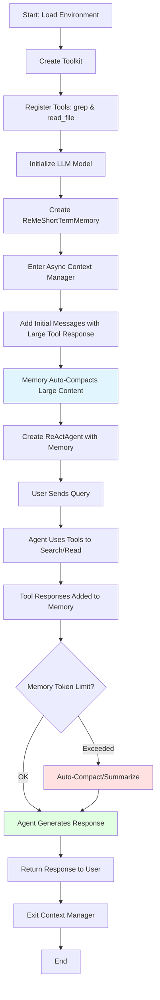

# ReMe Short-Term Memory in AgentScope

This example demonstrates how to

- use ReMeShortTermMemory to provide automatic working memory management for AgentScope agents,
- handle long conversation contexts with intelligent summarization and compaction,
- integrate short-term memory with ReAct agents for efficient tool usage and context management, and
- configure DashScope models for memory operations.

## Why Short-Term Memory?

### The Challenge: From Prompt Engineering to Context Engineering

As AI agents evolved from simple chatbots to sophisticated autonomous systems, the focus shifted from "prompt engineering" to "context engineering". While prompt engineering focused on crafting effective instructions for language models, context engineering addresses a more fundamental challenge: **managing the ever-growing conversation and tool execution history that agents accumulate**.

### The Core Problem: Context Explosion

Agentic systems work by binding LLMs with tools and running them in a loop where the agent decides which tools to call and feeds results back into the message history. This creates a snowball effect:

- **Rapid Growth**: A seemingly simple task can trigger 50+ tool calls, with production agents often running hundreds of conversation turns
- **Large Outputs**: Each tool call can return substantial text, consuming massive amounts of tokens
- **Memory Pressure**: The context window quickly fills up as messages and tool results accumulate chronologically

### The Consequence: Context Rot

When context grows too large, model performance degrades significantly—a phenomenon known as **"context rot"**:

- **Repetitive Responses**: The model starts generating redundant or circular answers
- **Slower Reasoning**: Inference becomes noticeably slower as context length increases
- **Quality Degradation**: Overall response quality and coherence decline
- **Lost Focus**: The model struggles to identify relevant information in the bloated context

### The Fundamental Paradox

Agents face a critical tension:

- **Need Rich Context**: Agents require comprehensive historical information to make informed decisions
- **Suffer from Large Context**: Excessive context causes performance degradation and inefficiency

**Context management aims to keep "just enough" information in the window**—sufficient for effective decision-making while leaving room for retrieval and expansion, without overwhelming the model.

### Why Short-Term Memory Management Matters

Effective short-term memory management is essential for:

1. **Maintaining Performance**: Keeping context within optimal size prevents quality degradation
2. **Enabling Long-Running Tasks**: Agents can handle complex, multi-step workflows without hitting context limits
3. **Cost Efficiency**: Reducing token usage directly lowers API costs
4. **Preserving Reasoning Quality**: Clean, focused context helps models maintain coherent reasoning chains
5. **Scalability**: Proper memory management allows agents to scale to production workloads

### The Solution: Intelligent Context Management

ReMeShortTermMemory implements proven context management strategies:

- **Context Offloading**: Moving large tool outputs to external storage while keeping references
- **Context Reduction**: Compacting tool results into minimal representations and summarizing when necessary
- **Smart Retention**: Keeping recent messages intact to maintain continuity and provide usage examples
- **Automatic Triggering**: Monitoring token usage and applying strategies before performance degrades

By implementing these strategies, ReMeShortTermMemory enables agents to handle arbitrarily long conversations and complex tasks while maintaining optimal performance throughout.

## Prerequisites

- Python 3.10 or higher
- DashScope API key from Alibaba Cloud


## QuickStart

Install agentscope and ensure you have a valid DashScope API key in your environment variables.

> Note: The example is built with DashScope chat model. If you want to use OpenAI models instead,
> modify the model initialization in the example code accordingly.

```bash
# Install agentscope from source
cd {PATH_TO_AGENTSCOPE}
pip install -e .
# Install dependencies
pip install reme-ai python-dotenv
```

Set up your API key:

```bash
export DASHSCOPE_API_KEY='YOUR_API_KEY'
```

Or create a `.env` file:

```bash
DASHSCOPE_API_KEY=YOUR_API_KEY
```

Run the example:

```bash
python short_term_memory_example.py
```

The example will:
1. Initialize a ReMeShortTermMemory instance with DashScope models
2. Demonstrate automatic memory compaction for long tool responses
3. Show integration with ReActAgent for context-aware conversations
4. Use grep and read_file tools to search and retrieve information from files

## Key Features

- **Automatic Memory Management**: Intelligent summarization and compaction of working memory to handle long contexts
- **Tool Response Optimization**: Automatic truncation and summarization of large tool responses to stay within token limits
- **Flexible Configuration**: Configurable thresholds for compaction ratio, token limits, and recent message retention
- **ReAct Agent Integration**: Seamless integration with AgentScope's ReActAgent and tool system
- **Async Operations**: Full async support for non-blocking memory operations

## Basic Usage

This section provides a detailed walkthrough of the `short_term_memory_example.py` code, explaining how each component works together to create an agent with intelligent context management.

### Configuration Parameters

#### `ReMeShortTermMemory` Class Parameters

The `ReMeShortTermMemory` class accepts the following initialization parameters:

- **`model`** (`DashScopeChatModel | OpenAIChatModel | None`): Language model for compression operations. Must be either `DashScopeChatModel` or `OpenAIChatModel`. This model is used for LLM-based compression when generating compact state snapshots. **Required**.

- **`reme_config_path`** (`str | None`): Optional path to ReMe configuration file for custom settings. Use this to provide advanced ReMe configurations beyond the standard parameters. Default: `None`.

- **`working_summary_mode`** (`str`): Strategy for working memory management. Controls how the memory system handles context overflow:
  - `"compact"`: Only compact verbose tool messages by storing full content externally and keeping short previews in the active context.
  - `"compress"`: Only apply LLM-based compression to generate compact state snapshots of conversation history.
  - `"auto"`: First run compaction, then optionally run compression if the compaction ratio exceeds `compact_ratio_threshold`. This is the recommended mode for most use cases.

  Default: `"auto"`.

- **`compact_ratio_threshold`** (`float`): Threshold for compaction effectiveness in AUTO mode. If `(compacted_tokens / original_tokens) > compact_ratio_threshold`, compression is applied after compaction. This ensures compression only runs when compaction alone isn't sufficient. Valid range: 0.0 to 1.0. Default: `0.75`.

- **`max_total_tokens`** (`int`): Maximum token count threshold before compression is triggered. This limit does **not** include `keep_recent_count` messages or system messages, which are always preserved. Should be set to 20%-50% of your model's context window size to leave room for new tool calls and responses. Default: `20000`.

- **`max_tool_message_tokens`** (`int`): Maximum token count for individual tool messages before compaction. Tool messages exceeding this limit are stored externally in files, with only a short preview kept in the active context. This is the maximum tolerable length for a single tool response. Default: `2000`.

- **`group_token_threshold`** (`int | None`): Maximum token count per compression group when splitting messages for LLM compression. When set to a positive integer, long message sequences are split into smaller batches for compression. If `None` or `0`, all messages are compressed in a single group. Use this to control the granularity of compression operations. Default: `None`.

- **`keep_recent_count`** (`int`): Number of most recent messages to preserve without compression or compaction. These messages remain in full in the active context to maintain conversation continuity and provide usage examples for the agent. The example uses `1` for demonstration purposes; **in production, a value of `10` is recommended** to maintain better conversation flow. Default: `10`.

- **`store_dir`** (`str`): Directory path for storing offloaded message content and compressed history files. This is where external files containing full tool responses and compressed message history are saved. The directory will be created automatically if it doesn't exist. Default: `"inmemory"`.

- **`**kwargs`** (`Any`): Additional arguments passed to `ReMeApp` initialization. Use this to pass any extra configuration options supported by the underlying ReMe application.

#### Parameter Relationships and Best Practices

- **Token Budget Strategy**: Set `max_total_tokens` to 20%-50% of your model's context window. For example, if your model has a 128K context window, set `max_total_tokens` between 25,600 and 64,000 tokens.

- **Compaction vs Compression**:
  - Compaction is fast and lossless (full content is stored externally)
  - Compression is slower but more aggressive (uses LLM to summarize)
  - Use `"auto"` mode to benefit from both strategies

- **Recent Message Retention**: Higher `keep_recent_count` values (e.g., 10) provide better context continuity but consume more tokens. Lower values (e.g., 1) are more aggressive but may lose important recent context.

- **Tool Message Handling**: Adjust `max_tool_message_tokens` based on your typical tool response sizes. If your tools frequently return large outputs (e.g., file contents, API responses), consider a higher threshold or ensure compaction is enabled.

### Code Flow Diagram



### Step-by-Step Code Walkthrough

The example demonstrates a complete workflow from tool registration to agent interaction. Here's a detailed breakdown:

#### 1. Environment Setup and Imports

```python
import asyncio
import os
from dotenv import load_dotenv

load_dotenv()
```

The code starts by loading environment variables (including the DashScope API key) from a `.env` file.

#### 2. Tool Registration

The example defines two custom tools that demonstrate how to integrate retrieval operations:

**`grep` Tool**: Searches for patterns in files using regular expressions
```python
async def grep(file_path: str, pattern: str, limit: str) -> ToolResponse:
    """A powerful search tool for finding patterns in files..."""
    from reme_ai.retrieve.working import GrepOp

    op = GrepOp()
    await op.async_call(file_path=file_path, pattern=pattern, limit=limit)
    return ToolResponse(
        content=[TextBlock(type="text", text=op.output)],
    )
```

**`read_file` Tool**: Reads specific line ranges from files
```python
async def read_file(file_path: str, offset: int, limit: int) -> ToolResponse:
    """Reads and returns the content of a specified file..."""
    from reme_ai.retrieve.working import ReadFileOp

    op = ReadFileOp()
    await op.async_call(file_path=file_path, offset=offset, limit=limit)
    return ToolResponse(
        content=[TextBlock(type="text", text=op.output)],
    )
```

> **Important Note on Tool Replaceability**:
> - The `grep` and `read_file` tools shown here are **example implementations** using ReMe's built-in operations
> - You can **replace them with your own retrieval tools**, such as:
>   - Vector database embedding retrieval (e.g., ChromaDB, Pinecone, Weaviate)
>   - Web search APIs (e.g., Google Search, Bing Search)
>   - Database query tools (e.g., SQL queries, MongoDB queries)
>   - Custom domain-specific search solutions
> - Similarly, the **offline write operations** (used internally by ReMeShortTermMemory to store compacted content) can be customized by modifying the `write_text_file` function in AgentScope's tool system
> - The key requirement is that your tools return `ToolResponse` objects with appropriate content blocks

#### 3. LLM Model Initialization

```python
llm = DashScopeChatModel(
    model_name="qwen3-coder-30b-a3b-instruct",
    api_key=os.environ.get("DASHSCOPE_API_KEY"),
    stream=False,
    generate_kwargs={
        "temperature": 0.001,
        "seed": 0,
    },
)
```

The model is configured with low temperature for consistent, deterministic responses. This same model will be used for both agent reasoning and memory summarization operations.

#### 4. Short-Term Memory Initialization

```python
short_term_memory = ReMeShortTermMemory(
    model=llm,
    working_summary_mode="auto",           # Automatic memory management
    compact_ratio_threshold=0.75,          # Trigger compaction at 75% capacity
    max_total_tokens=20000,                # Set to 20%-50% of model's context window
    max_tool_message_tokens=2000,          # Maximum tolerable tool response length
    group_token_threshold=None,            # Max tokens per LLM compression batch; None means no splitting
    keep_recent_count=1,                   # Keep 1 recent message intact (set to 1 for demo; use 10 in production)
    store_dir="inmemory",            # Storage directory for offloaded content
)
```

This configuration enables automatic memory management that will:
- Monitor token usage
- Automatically compact large tool responses when they exceed `max_tool_message_tokens`
- Trigger summarization when total tokens exceed `max_total_tokens` and compaction ratio exceeds `compact_ratio_threshold`

#### 5. Async Context Manager Usage

```python
async with short_term_memory:
    # All memory operations happen here
```

The `async with` statement ensures proper initialization and cleanup of memory resources. This is the recommended approach for using `ReMeShortTermMemory`.

#### 6. Simulating Long Context

The example demonstrates memory compaction by adding a large tool response:

```python
# Read README content and multiply it 10 times to simulate a large response
f = open("../../../../README.md", encoding="utf-8")
readme_content = f.read()
f.close()

memories = [
    {
        "role": "user",
        "content": "搜索下项目资料",
    },
    {
        "role": "assistant",
        "content": None,
        "tool_calls": [...],  # Tool call metadata
    },
    {
        "role": "tool",
        "content": readme_content * 10,  # Large tool response (10x README)
        "tool_call_id": "call_6596dafa2a6a46f7a217da",
    },
]

await short_term_memory.add(
    ReMeShortTermMemory.list_to_msg(memories),
    allow_duplicates=True,
)
```

When this large content is added, `ReMeShortTermMemory` will:
1. Detect that the tool response exceeds `max_tool_message_tokens` (the maximum tolerable tool response length, set to 2000 in this example)
2. Automatically compact it by storing the full content in an external file
3. Keep only a short preview in the active memory
4. This happens transparently without manual intervention

#### 7. ReAct Agent Creation

```python
agent = ReActAgent(
    name="react",
    sys_prompt=(
        "You are a helpful assistant. "
        "工具调用的调用可能会被缓存到本地。"
        "可以先使用`Grep`匹配关键词或者正则表达式所在行数，然后通过`ReadFile`读取位置附近的代码。"
        # ... more instructions
    ),
    model=llm,
    formatter=DashScopeChatFormatter(),
    toolkit=toolkit,
    memory=short_term_memory,  # Memory is integrated here
    max_iters=20,
)
```

The agent is configured with:
- The same LLM model used for memory operations
- The toolkit containing `grep` and `read_file` tools
- The `short_term_memory` instance for automatic context management
- A system prompt that guides the agent on tool usage patterns

#### 8. Agent Interaction

```python
msg = Msg(
    role="user",
    content=("项目资料中，agentscope_v1论文的一作是谁？"),
    name="user",
)
msg = await agent(msg)
print(f"✓ Agent response: {msg.get_text_content()}\n")
```

When the agent processes this message:
1. It receives the user query
2. Decides to use tools (e.g., `grep` to search for "agentscope_v1")
3. Tool responses are automatically added to memory
4. If memory grows too large, automatic compaction occurs
5. The agent generates a response based on the managed context
6. The response is returned to the user

### Complete Example Code Structure

```python
async def main() -> None:
    # 1. Create toolkit and register tools
    toolkit = Toolkit()
    toolkit.register_tool_function(grep)
    toolkit.register_tool_function(read_file)

    # 2. Initialize LLM
    llm = DashScopeChatModel(...)

    # 3. Create short-term memory
    short_term_memory = ReMeShortTermMemory(...)

    # 4. Use async context manager
    async with short_term_memory:
        # 5. Add initial messages (with large content to demo compaction)
        await short_term_memory.add(messages, allow_duplicates=True)

        # 6. Create agent with memory
        agent = ReActAgent(..., memory=short_term_memory, ...)

        # 7. Interact with agent
        response = await agent(user_message)
```

### Key Takeaways

1. **Automatic Memory Management**: Memory compaction and summarization happen automatically when thresholds are exceeded
2. **Tool Integration**: Tools return `ToolResponse` objects that are seamlessly integrated into memory
3. **Async Context Manager**: Always use `async with short_term_memory:` to ensure proper resource management
4. **Flexible Tool System**: The `grep` and `read_file` tools are examples—you can replace them with any retrieval mechanism that fits your use case
5. **Transparent Operation**: Memory management is transparent to the agent—it just sees a clean, focused context

### Using Async Context Manager

`ReMeShortTermMemory` implements the async context manager protocol, which ensures proper initialization and cleanup of resources. There are two ways to use it:

#### Recommended: Using `async with` Statement

The recommended approach is to use the `async with` statement, which automatically handles resource management:

```python
async with short_term_memory:
    # Memory is initialized here
    await short_term_memory.add(messages)
    response = await agent(msg)
    # Memory is automatically cleaned up when exiting the block
```

#### Alternative: Manual `__aenter__` and `__aexit__` Calls

You can also manually call `__aenter__` and `__aexit__` if you need more control:

```python
# Manually initialize
await short_term_memory.__aenter__()

try:
    # Use the memory
    await short_term_memory.add(messages)
    response = await agent(msg)
finally:
    # Manually cleanup
    await short_term_memory.__aexit__(None, None, None)
```

> **Note**: It's recommended to use the `async with` statement as it ensures proper resource cleanup even if an exception occurs.

## Advanced Configuration

You can customize the ReMe config by passing a config path:

```python
short_term_memory = ReMeShortTermMemory(
    model=llm,
    reme_config_path="path/to/your/config.yaml",  # Pass your custom ReMe configuration
    # ... other parameters
)
```

For more configuration options, refer to the [ReMe documentation](https://github.com/agentscope-ai/ReMe).

## What's in the Example

The `short_term_memory_example.py` file demonstrates:

1. **Tool Integration**: Registering `grep` and `read_file` tools for searching and reading files
2. **Memory Initialization**: Setting up ReMeShortTermMemory with appropriate parameters for handling long contexts
3. **Long Context Handling**: Adding a large tool response (README content × 10) to demonstrate automatic memory compaction
4. **ReAct Agent Usage**: Using the agent with short-term memory to answer questions based on retrieved information

## Example Workflow

The example shows a typical workflow:

1. User asks to search for project information
2. Agent uses `grep` tool to find relevant content
3. Agent uses `read_file` tool to read specific sections
4. Large tool responses are automatically compacted by the memory system
5. Agent answers the user's question based on the retrieved information

