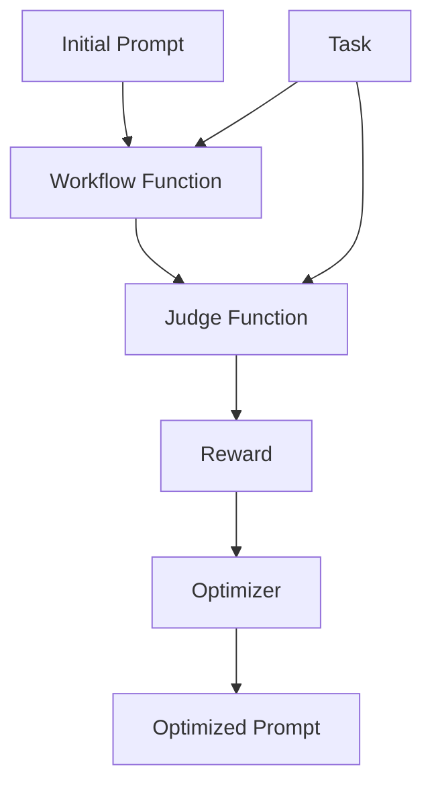

# Prompt Tuning Guide

AgentScope provides a `prompt_tune` sub-module to automatically optimize system prompts.
This guide walks you through the steps to optimize your agent's system prompt without modifying model weights.

## Overview

Prompt tuning is a lightweight alternative to model fine-tuning that optimizes the system prompt to improve agent performance. To use prompt tuning, you need to understand three components:

1. **Workflow function**: An async function that takes a task and system prompt, returns a workflow output.
2. **Judge function**: A function that evaluates the agent's response and returns a reward.
3. **Task dataset**: A dataset containing training samples for optimization.

The following diagram illustrates the relationship between these components:



## How to implement

Here we use a math problem solving scenario as an example to illustrate how to implement the above three components.

Suppose you have an agent workflow that solves math problems using the `ReActAgent`.

```python
from agentscope.agent import ReActAgent

async def run_react_agent(query: str):
    # model = ...  # Initialize your ChatModel here

    agent = ReActAgent(
        name="react_agent",
        sys_prompt="You are a helpful math problem solving agent.",
        model=model,
        formatter=OpenAIChatFormatter(),
    )

    response = await agent.reply(
        msg=Msg("user", query, role="user"),
    )

    print(response)
```

### Step 1: Prepare task dataset

To optimize the prompt for solving math problems, you need a dataset that contains samples of math problems and their corresponding ground truth answers.

The dataset should be organized in a format that can be loaded using the `datasets.load_dataset` function (e.g., JSONL, Parquet, CSV). For example:

```
my_dataset/
    ├── train.parquet  # samples for training/optimization
    └── test.parquet   # samples for evaluation
```

Suppose your `train.parquet` contains samples like:

```json
{"question": "What is 2 + 2?", "answer": "4"}
{"question": "What is 4 + 4?", "answer": "8"}
```

You can preview your dataset using the following code:

```python
from agentscope.tuner import DatasetConfig

DatasetConfig(path="train.parquet").preview()

# Output:
# [
#   {
#     "question": "What is 2 + 2?",
#     "answer": "4"
#   },
#   {
#     "question": "What is 4 + 4?",
#     "answer": "8"
#   }
# ]
```

### Step 2: Define a workflow function

The workflow function takes a task dictionary and system prompt as input, and returns a `WorkflowOutput`. The optimizer will call this function with different prompts during optimization.

```python
async def workflow(
    task: Dict,
    system_prompt: str,
) -> WorkflowOutput:
    """Run the agent workflow on a single task with the given system prompt."""
    ...
```

- Inputs:
    - `task`: A dictionary representing a single training task from the dataset.
    - `system_prompt`: The system prompt to be used in the workflow. This will be optimized by the tuner.

- Returns:
    - `WorkflowOutput`: An object containing the agent's response.

Below is a refactored version of the original `run_react_agent` function to fit the workflow function pattern.

**Key changes from the original function**:

1. Add `system_prompt` as a parameter to the workflow function.
2. Use the input `system_prompt` to initialize the agent.
3. Use the `question` field from the `task` dictionary as the user query.
4. Return a `WorkflowOutput` object containing the agent's response.

```python
from agentscope.agent import ReActAgent
from agentscope.formatter import OpenAIChatFormatter
from agentscope.tuner import WorkflowOutput
from agentscope.message import Msg

# Initialize the model (can be module-level or passed in via closure)
model = DashScopeChatModel("qwen-turbo", api_key="YOUR_API_KEY")

async def workflow(
    task: Dict,
    system_prompt: str,
) -> WorkflowOutput:
    agent = ReActAgent(
        name="react_agent",
        sys_prompt=system_prompt,  # use the optimizable system prompt
        model=model,
        formatter=OpenAIChatFormatter(),
    )

    response = await agent.reply(
        msg=Msg("user", task["question"], role="user"),
    )

    return WorkflowOutput(
        response=response,
    )
```

### Step 3: Implement the judge function

The judge function evaluates the agent's response and returns a reward. It has the same signature as in RL-based tuning.

```python
async def judge_function(
    task: Dict,
    response: Any,
) -> JudgeOutput:
    """Calculate reward based on the input task and agent's response."""
```

- Inputs:
    - `task`: A dictionary representing a single training task.
    - `response`: The `response` field of the `WorkflowOutput` struct returned by the workflow function.

- Outputs:
    - `JudgeOutput`: An object containing:
        - `reward`: A scalar float representing the reward.
        - `metrics`: Optional dictionary of additional metrics.

Here is an example implementation:

```python
from agentscope.tuner import JudgeOutput

async def judge_function(
    task: Dict, response: Any
) -> JudgeOutput:
    """Simple reward: 1.0 for exact match, else 0.0."""
    ground_truth = task["answer"]
    reward = 1.0 if ground_truth in response.get_text_content() else 0.0
    return JudgeOutput(reward=reward)
```

### Step 4: Start prompt tuning

Use the `tune_prompt` interface to optimize your system prompt.

```python
from agentscope.tuner import DatasetConfig
from agentscope.tuner.prompt_tune import tune_prompt, PromptTuneConfig

# your workflow / judge function here...

if __name__ == "__main__":
    init_prompt = "You are an agent. Please solve the math problem given to you."

    optimized_prompt, metrics = tune_prompt(
        workflow=workflow,
        init_system_prompt=init_prompt,
        judge_func=judge_function,
        train_dataset=DatasetConfig(path="train.parquet"),
        eval_dataset=DatasetConfig(path="test.parquet"),
        config=PromptTuneConfig(
            lm_model_name="dashscope/qwen-plus",
            optimization_level="light",
        ),
    )

    print(f"Optimized prompt: {optimized_prompt}")
    print(f"Metrics: {metrics}")
```

Here, we use:
- `DatasetConfig` to specify the training and evaluation datasets.
- `PromptTuneConfig` to configure the optimization process.

#### PromptTuneConfig Options

| Parameter | Default | Description |
|-----------|---------|-------------|
| `lm_model_name` | `"dashscope/qwen-plus"` | The model name for the prompt proposer (teacher model). |
| `optimization_level` | `"light"` | Optimization intensity: `"light"`, `"medium"`, or `"heavy"`. |
| `eval_display_progress` | `True` | Whether to display progress during evaluation. |
| `eval_display_table` | `5` | Number of table rows to display during evaluation. |
| `eval_num_threads` | `16` | Number of threads for parallel evaluation. |
| `compare_performance` | `True` | Whether to compare baseline vs optimized performance. |

---

### Complete example

```python
import os
from typing import Dict

from agentscope.tuner import DatasetConfig, WorkflowOutput, JudgeOutput
from agentscope.tuner.prompt_tune import tune_prompt, PromptTuneConfig
from agentscope.agent import ReActAgent
from agentscope.model import ChatModelBase, DashScopeChatModel
from agentscope.formatter import OpenAIChatFormatter
from agentscope.message import Msg


# Initialize the model for the workflow
model = DashScopeChatModel(
    "qwen-turbo",
    api_key=os.environ.get("DASHSCOPE_API_KEY", ""),
)


async def workflow(
    task: Dict,
    system_prompt: str,
) -> WorkflowOutput:
    agent = ReActAgent(
        name="react_agent",
        sys_prompt=system_prompt,
        model=model,
        formatter=OpenAIChatFormatter(),
    )

    response = await agent.reply(
        msg=Msg("user", task["question"], role="user"),
    )

    return WorkflowOutput(
        response=response,
    )


async def judge_function(
    task: Dict, response: Any
) -> JudgeOutput:
    """Simple reward: 1.0 for exact match, else 0.0."""
    ground_truth = task["answer"]
    reward = 1.0 if ground_truth in response.get_text_content() else 0.0
    return JudgeOutput(reward=reward)


if __name__ == "__main__":
    init_prompt = (
        "You are an agent."
        "Please solve the math problem given to you."
        "You should provide your output within \\boxed{{}}."
    )

    optimized_prompt, metrics = tune_prompt(
        workflow=workflow,
        init_system_prompt=init_prompt,
        judge_func=judge_function,
        train_dataset=DatasetConfig(path="train.parquet"),
        eval_dataset=DatasetConfig(path="test.parquet"),
    )

    print(f"Optimized prompt: {optimized_prompt}")
    print(f"Metrics: {metrics}")
```

> Note:
> Above code is a simplified example for illustration purposes only.
> For a complete implementation, please refer to [example.py](./example.py), which tunes a ReAct agent to solve math problems on the GSM8K subset dataset.

---

## How to run

After implementing the workflow and judge function, follow these steps to run prompt tuning:

1. Prerequisites

    - Set up your API key as an environment variable:

      ```bash
      export DASHSCOPE_API_KEY="your_api_key_here"
      ```

    - Prepare your dataset in a supported format (JSONL, Parquet, CSV, etc.).

2. Run the tuning script

    ```bash
    python example.py
    ```

3. The optimized prompt will be printed to the console and can be used directly in your agent.

## Output

```
Initial prompt: You are an agent. Please solve the math problem given to you with python code. You should provife your output within \boxed{}.

Optimized prompt: You are a meticulous math tutor who solves elementary-to-middle-school-level word problems step by step. For each problem, first reason through the narrative to identify the key quantities and relationships. Then, write clear, executable Python code that computes the answer using only integer arithmetic. Finally, present your solution in the format \boxed{answer}, ensuring the answer is an integer and matches the logic of your explanation. Always double-check your reasoning and code before finalizing the boxed result.
```

---

## Comparison with RL-based Tuning

| Aspect | Prompt Tuning | RL-based Tuning |
|--------|---------------|-----------------|
| **What is optimized** | System prompt text | Model weights |
| **Computational cost** | Low (API calls only) | High (GPU training) |
| **Hardware requirements** | No GPU required | Multiple GPUs required |
| **Use case** | Quick iteration, limited resources | Maximum performance |

> [!TIP]
> Prompt tuning is ideal for rapid prototyping and scenarios where you want to improve agent performance without the overhead of model training.
